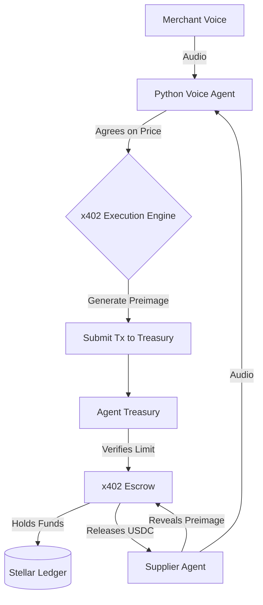

<div align="center">
  <h1>voxtrade-contract</h1>
  <p><strong>Sovereign Voice-to-Voice Commerce: Machine-to-Machine x402 Negotiation on Stellar</strong></p>
  <p>
    
    
    
  </p>
  <p>
    <a href="https://github.com/voxxtrade/voxtrade-app"><strong>VoxTrade App</strong></a> &bull;
    <a href="#getting-started"><strong>Getting Started</strong></a> &bull;
    <a href="#architecture"><strong>Architecture</strong></a>
  </p>
</div>

> Part of the **[VoxTrade](https://github.com/voxxtrade)** suite. This repository houses the Soroban smart contracts for Sovereign Voice-to-Voice Commerce, enabling secure, trustless M2M negotiation.

## The Problem

AI agents today can talk, but they can't transact. When an AI personal assistant negotiates on your behalf to purchase a service (like booking a flight or paying for a premium API via x402), it lacks a secure, bounded financial mechanism to execute the payment without exposing the user to infinite risk. 

Giving an AI direct access to a credit card or unrestricted wallet is a massive security vulnerability. Furthermore, if the AI pays up front and the counterparty fails to deliver the promised digital good or service, the money is lost.

## The Solution

VoxTrade bridges machine-to-machine x402 negotiation to the Stellar network using two purpose-built Soroban smart contracts:

1. **AgentTreasury** &mdash; A policy-bounded vault that grants an AI agent restricted spending power. It enforces a strict rolling daily limit. If the AI goes rogue or gets compromised, the maximum loss is mathematically capped.
2. **X402Escrow** &mdash; A trustless Hash Time-Locked Contract (HTLC) designed for x402 exchanges. Funds are locked on-chain and only released when the seller reveals the cryptographic preimage (the receipt/service key). If the seller fails to deliver within the timeout, the funds are refunded to the buyer.

## Enforced Invariants & Test Coverage

VoxTrade enforces strict invariants to guarantee safety in autonomous M2M transactions:

- **Strict Daily Quotas** &mdash; An agent can never exceed its `daily_limit` within a 24-hour ledger window (`LimitExceeded`).
- **Cryptographic Delivery Verification** &mdash; The escrow will only release funds if the provided `preimage` exactly matches the `hash_lock` established during negotiation (`HashMismatch`).
- **Guaranteed Refunds on Timeout** &mdash; If a seller fails to deliver the service preimage before the `timeout_ledger`, the buyer is guaranteed a full refund (`TimeoutReached` / `TimeoutNotReached`).
- **Zero Double-Spending** &mdash; An escrow can only be claimed or refunded exactly once. Once `resolved`, all subsequent interactions are blocked (`AlreadyResolved`).
- **Admin Isolation** &mdash; Only the administrative address can initialize the treasury or upgrade the configuration. The agent key is strictly sandboxed to spending (`Unauthorized`).

## Smart Contract Errors

All operational errors return explicit, stable integer codes.

### AgentTreasury (`TreasuryError`)

| Code | Variant | Description |
|---|---|---|
| `1` | `Unauthorized` | An action was attempted without the required admin or agent signature. |
| `2` | `InsufficientBalance` | The treasury lacks the underlying tokens to fund the requested escrow. |
| `3` | `InvalidAmount` | The requested amount is zero or negative. |
| `4` | `NotFound` | The requested configuration or daily spend record does not exist. |
| `5` | `LimitExceeded` | The requested transaction would exceed the agent's strict daily quota. |
| `6` | `AlreadyInitialized` | An attempt was made to re-initialize an already configured treasury. |

### X402Escrow (`EscrowError`)

| Code | Variant | Description |
|---|---|---|
| `1` | `InvalidHash` | The provided hash is structurally invalid. |
| `2` | `AlreadyResolved` | The escrow has already been successfully claimed or refunded. |
| `3` | `TimeoutNotReached` | A refund was requested before the designated timeout ledger. |
| `4` | `TimeoutReached` | A claim was attempted after the escrow had expired. |
| `5` | `HashMismatch` | The provided preimage does not produce the expected hash lock. |
| `6` | `NotFound` | The requested escrow ID does not exist in storage. |
| `7` | `InvalidTimeout` | The provided timeout ledger is in the past. |
| `8` | `InvalidAmount` | The escrow lock amount is zero or negative. |

## Architecture

This repository adopts a strict separation of concerns, splitting execution across on-chain Soroban contracts and off-chain AI reasoning engines.

1. **Soroban Contracts (Rust)**: Running natively on the Stellar network, these handle the rigid security limits (the 24-hour treasury caps) and the cryptographic escrow locking (HTLCs).
2. **AI Voice Agent (Python/TS)**: Running off-chain, the agent listens to VoIP audio streams, negotiates terms, and acts as the programmatic signer for the smart contracts.

### Hybrid Sequence Flow



1. **Merchant Onboarding:** The human merchant uses their Freighter wallet to deploy an `agent_treasury` and authorize the AI's server-side Ed25519 key with a daily limit.
2. **AI Negotiation:** The merchant's Voice Agent calls the supplier's Agent over VoIP. They negotiate bulk pricing in natural language.
3. **Programmatic Settlement:** Once agreed, the merchant's AI signs an `execute_x402_lock` transaction. The treasury verifies the 24-hour limit hasn't been breached and securely locks the USDC in the HTLC `x402_escrow`.
4. **Delivery & Claim:** The supplier AI delivers the goods/API payload and claims the escrow by revealing the SHA256 preimage. If it fails, the funds timeout and refund.

## Repository Structure

```text
voxtrade-contract/
├── contracts/
│   ├── agent_treasury/           # The merchant-controlled AI allowance vault
│   │   ├── src/
│   │   │   ├── lib.rs            # Entrypoint and core logic
│   │   │   ├── errors.rs         # Treasury error definitions
│   │   │   ├── types.rs          # Data structures (Config, DailySpend)
│   │   │   └── test.rs           # Unit tests and bounds checking
│   │   └── Cargo.toml
│   └── x402_escrow/              # The trustless HTLC for cross-agent commerce
│       ├── src/
│       │   ├── lib.rs            # Entrypoint and commit-reveal logic
│       │   ├── errors.rs         # Escrow error definitions
│       │   ├── types.rs          # Escrow state (amount, hash_lock, timeouts)
│       │   └── test.rs           # Unit tests and timeout simulations
│       └── Cargo.toml
├── .github/workflows/ci.yml      # Parallelized CI (Format, Clippy, Test)
├── Cargo.lock                    # Pinned dependency resolution (V2)
├── Cargo.toml                    # Workspace configuration
└── README.md
```

## Getting Started

### Prerequisites

Ensure you have the Rust toolchain and the Soroban CLI installed:

```bash
rustup target add wasm32-unknown-unknown
cargo install --locked soroban-cli
```

### Build and Test

```bash
# Run all unit tests
cargo test

# Build WASM artifacts for deployment
cargo build --target wasm32-unknown-unknown --release
```

## Testing

VoxTrade maintains a rigorous testing pipeline. Tests run against the Soroban test environment on every push. Our CI enforces:
- `cargo fmt --check`
- `cargo clippy -D warnings`
- `cargo test`

We simulate ledger time advancement to guarantee rolling limits reset accurately and timeout bounds function precisely as expected.

## License

MIT License. See [LICENSE](LICENSE) for details.
