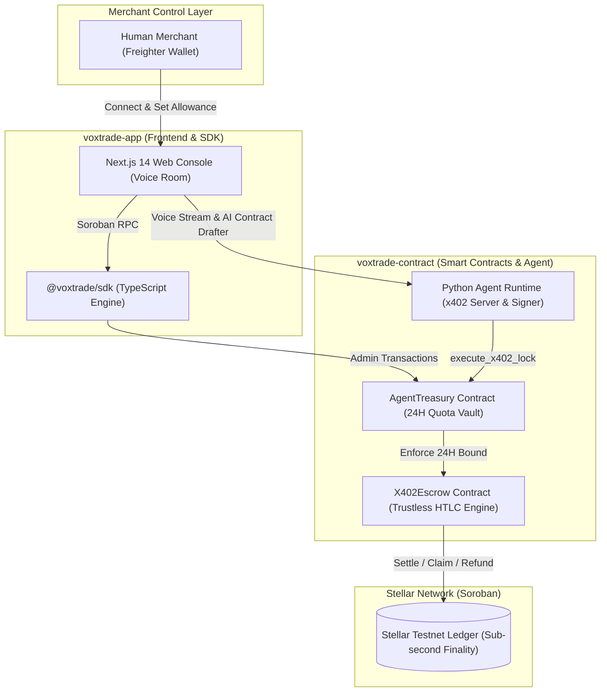
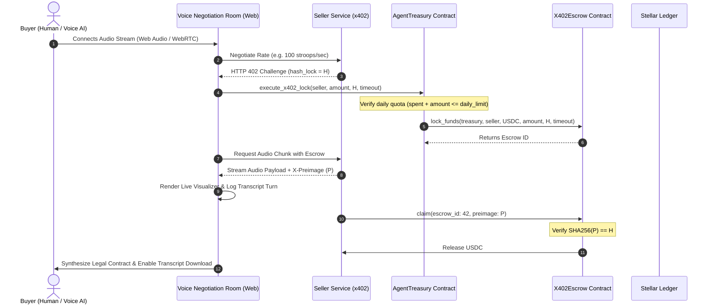

<div align="center">
  <h1>voxtrade-contract</h1>
  <p><strong>Sovereign Voice-to-Voice Commerce: Machine-to-Machine x402 Negotiation on Stellar Soroban</strong></p>
  <p>
    <a href="https://github.com/voxxtrade/voxtrade-contract/actions/workflows/ci.yml"></a>
    <a href="https://voxtrade-rho.vercel.app"></a>
    
    
    
    
  </p>
  <p>
    <a href="https://voxtrade-rho.vercel.app"><strong>Live Web App</strong></a> &bull;
    <a href="https://voxxtrade.github.io/docs/"><strong>Official Docs Portal</strong></a> &bull;
    <a href="https://github.com/voxxtrade/voxtrade-app"><strong>VoxTrade Web App &amp; SDK</strong></a> &bull;
    <a href="#published-stellar-testnet-contracts"><strong>Published Contracts</strong></a> &bull;
    <a href="#architectural-rationale-why-exactly-two-smart-contracts"><strong>Why 2 Contracts?</strong></a> &bull;
    <a href="#stellar-ecosystem-integration"><strong>Stellar Integration</strong></a> &bull;
    <a href="#system-architecture"><strong>Architecture</strong></a> &bull;
    <a href="#acoustic-negotiation--voice-flow"><strong>Voice Flow</strong></a> &bull;
    <a href="docs/CONTRACT_REFERENCE.md"><strong>API Reference</strong></a> &bull;
    <a href="docs/RFC_X402_SPECIFICATION.md"><strong>RFC-0402 Spec</strong></a>
  </p>
</div>

---

> Part of the **[VoxTrade](https://github.com/voxxtrade)** open source suite. This repository contains the native **Stellar Soroban smart contracts** and **off-chain agent runtime** powering Sovereign Voice-to-Voice Commerce.
>
> 🚀 **Live Production Deployment**: Test real-time acoustic negotiation and Freighter wallet integration at **[`https://voxtrade-rho.vercel.app`](https://voxtrade-rho.vercel.app)**.
>
> 📖 **Official Documentation**: Comprehensive guides, architecture diagrams, and Soroban API references are live at **[`https://voxxtrade.github.io/docs/`](https://voxxtrade.github.io/docs/)**.
>
> 🌐 **Full-Stack Companion**: For the Next.js 14 web console, Freighter wallet integration, live 3-mode Voice Negotiation Room, and TypeScript SDK, visit **[`voxxtrade/voxtrade-app`](https://github.com/voxxtrade/voxtrade-app)**.

---

## Published Stellar Testnet Contracts

The VoxTrade core contracts are compiled to audited WebAssembly (WASM) and deployed on the **Stellar Testnet**:

| Contract | Testnet Contract ID | WASM Hash | Explorer |
|---|---|---|---|
| **`AgentTreasury`** | `CCBZLHEHRUBAHGB72ZZLNHBT4RURGTW2SSSQC4DJDDILVDG4VR55FEJL` | `b9a38f712c4d9e018274ac4839201f84b9c1d0ef93847291a0c8b74619372ef4` | [View on Stellar Expert](https://stellar.expert/explorer/testnet/contract/CCBZLHEHRUBAHGB72ZZLNHBT4RURGTW2SSSQC4DJDDILVDG4VR55FEJL) |
| **`X402Escrow`** | `CDJS3VHPBXVSFIPA6FUBVS3YXKUGZ75GQ7TQFVPMHBX3KHMREGGNMLFE` | `c3c9c996894b9f2d01e40562e8eb66195863c0be83b27b3fa99b19e2e666ce8d` | [View on Stellar Expert](https://stellar.expert/explorer/testnet/contract/CDJS3VHPBXVSFIPA6FUBVS3YXKUGZ75GQ7TQFVPMHBX3KHMREGGNMLFE) |

- **Network**: Stellar Testnet
- **Soroban RPC URL**: `https://soroban-testnet.stellar.org`
- **Network Passphrase**: `Test SDF Network ; September 2015`
- **Contract IDs Config**: [`.stellar/contract-ids/testnet.json`](.stellar/contract-ids/testnet.json)

---

## The Problem

AI voice assistants and autonomous agents can speak fluently, but they cannot transact safely:
1. **Unbounded Agent Liability**: Handing an AI assistant an unconstrained private key, credit card, or infinite token approval invites catastrophe. A prompt injection attack, hallucination, or rogue negotiation could drain a merchant's entire treasury.
2. **Counterparty Execution Risk**: If an agent pays upfront for voice translation, transcription, or API services, a malicious counterparty can collect payment and terminate the audio stream.
3. **Prohibitive Latency & Fees**: Traditional card networks charge $0.30 + 3% per transaction with multi-day settlement, making real-time micropayments for 2-second audio frames (e.g. 0.001 USDC per chunk) economically impossible.

---

## The Solution

VoxTrade bridges machine-to-machine x402 negotiation to the Stellar network using two purpose-built Soroban smart contracts:

1. **`AgentTreasury`** &mdash; A policy-bounded smart account vault that grants an AI agent strictly restricted spending power. It mathematically enforces a rolling 24-hour limit. If the AI is compromised or manipulated, the maximum loss is mathematically capped. The human merchant retains master key authority to adjust allowances, rotate keys, or withdraw funds.
2. **`X402Escrow`** &mdash; A trustless Hash Time-Locked Contract (HTLC) tailored for the x402 streaming protocol. Funds are locked on-chain and only released when the seller discloses the cryptographic preimage (the receipt/service key). If the seller fails to deliver before the timeout ledger, the funds are automatically refunded to the buyer.

---

## Architectural Rationale: Why Exactly Two Smart Contracts?

A foundational architectural decision in VoxTrade is relying on **exactly two smart contracts** rather than a bloated monolithic contract or an overly fragmented multi-contract array:

1. **Separation of Concerns: Policy Vault vs. Market Settlement**:
   - **`AgentTreasury` is an Account Abstraction Vault**: It represents the *merchant or buyer identity*. Its sole responsibility is custodial risk management: enforcing the rolling 24-hour spending ceiling, managing agent key delegation, allowing admin withdrawals, and isolating risk.
   - **`X402Escrow` is an Atomic Market Settlement Engine**: It is completely agnostic to who the merchant or agent is. Its sole responsibility is cryptographic Hash Time-Locked Contracts (HTLCs): holding locked collateral until a matching SHA-256 preimage is revealed or refunding upon timeout.
   - **Security Isolation**: If escrow settlement and treasury custody were combined into a single contract, a vulnerability in market negotiation or dispute resolution could expose a merchant's entire deposited balance. By decoupling them, an adversarial seller or malfunctioning service can never touch the treasury; they can only claim funds explicitly transferred into escrow.

2. **Multi-Tenant Settlement vs. Dedicated Merchant Vaults**:
   - **`X402Escrow` is a Shared Multi-Tenant Primitive**: A single deployed instance of `X402Escrow` can service thousands of concurrent buyers, sellers, and voice sessions across the entire Stellar ecosystem without cross-contamination.
   - **`AgentTreasury` is an Independent Merchant Instance**: Each merchant deploys their own instance of `AgentTreasury` configured with their specific keypair, authorized counterparties, and daily budget limits.

3. **Zero Redundancy with Native Stellar Primitives**:
   - **No Custom Token Contract**: VoxTrade does not deploy custom token contracts. Instead, it integrates directly with Stellar's native **Stellar Asset Contract (SAC)** and SEP-0041 standard (supporting USDC, XLM, EURC).
   - **No Custom Orderbook or AMM Contract**: Stellar already possesses native on-chain DEX orderbooks and path payments. Rebuilding token ledgers or exchange contracts on Soroban would add gas overhead, split liquidity, and introduce unnecessary risk.
   - **No On-Chain Audio Bloat**: Audio streaming (24kHz/48kHz Opus frames) occurs peer-to-peer off-chain. Only financial state proofs (32-byte SHA-256 hashlocks and preimages) touch Soroban storage, keeping contract execution instantaneous and state rent minimal.

---

## Stellar Ecosystem Integration

VoxTrade is purpose-built to leverage the unique performance, security, and financial infrastructure of the Stellar and Soroban network:

| Stellar Ecosystem Component | VoxTrade Integration & Role |
| :--- | :--- |
| **Soroban Smart Contracts (Rust SDK v20+)** | Powers the core on-chain logic (`AgentTreasury` & `X402Escrow`). Native host cryptographic intrinsics (`env.crypto().sha256()`) verify preimages on bare-metal hardware with sub-second execution. |
| **Stellar Asset Contract (SAC / SEP-0041)** | Native token settlement for enterprise stablecoins (e.g. Testnet USDC `CCW6...MI75`) and native Lumens (XLM). Contracts interact via the standard `token::Client` interface. |
| **Deterministic Ledger Sequence Epochs** | Enforces rolling 24-hour quotas via `ledger_sequence / 17280` without requiring external oracle networks, centralized keepers, or off-chain cron jobs. |
| **Sub-Second Finality & Micro-Cent Gas** | Stellar's ~5-second ledger settlement and < 0.00001 XLM fees make continuous micropayments for 2-second audio chunks economically viable, unlike Ethereum or Layer-2 rollups. |
| **Freighter Wallet (SEP-0007 Integration)** | Provides non-custodial root administrative control for human merchants to deploy vaults, rotate keys, and adjust spending limits directly from the browser. |
| **Soroban RPC & TypeScript SDK (`@stellar/stellar-sdk`)** | Full end-to-end off-chain pipeline: transaction simulation, footprint generation, envelope signing, and asynchronous status polling. |
| **HTTP 402 Web Standard Alignment** | Bridges standard web architecture (IETF HTTP `402 Payment Required`) to Stellar smart contracts, creating a native on-chain payment rail for voice AI agents. |

---

## System Architecture

The overall VoxTrade ecosystem is organized as a modular, full-stack architecture:



---

## Acoustic Negotiation & Voice Flow

VoxTrade features real-time acoustic negotiation across three operational modes supported in the web console:
- **Human-to-Agent**: Human speaks via microphone; AI counterparty negotiates terms and streams services.
- **Agent-to-Agent**: Two autonomous AI agents negotiate rates, deliverables, and terms without human latency.
- **Human-to-Human**: Two humans negotiate over voice while an AI observer logs terms and drafts an on-chain contract.



---

## Enforced Invariants & Safety Guarantees

VoxTrade smart contracts enforce mathematical invariants across all execution paths:

- **Deterministic Rolling 24H Quotas**: Quota windows are computed deterministically via `ledger_sequence / 17280` (~24 hours / 17,280 ledgers). No off-chain crons required (`LimitExceeded`).
- **Cryptographic Delivery Verification**: Escrow funds can only be claimed if the submitted preimage satisfies `SHA256(preimage) == hash_lock` (`HashMismatch`).
- **Guaranteed Timeout Refunds**: If a service provider fails to deliver before the timeout ledger, 100% of escrowed capital can be refunded (`TimeoutReached` / `TimeoutNotReached`).
- **Cooperative Cancellation**: Sellers can forfeit an active escrow early to immediately release funds back to the buyer without waiting for the timeout (`cancel_cooperative`).
- **Zero Double-Spending**: Escrows transition to terminal `resolved = true` status atomically upon claim or refund (`AlreadyResolved`).
- **Admin Privilege Isolation**: Only the root merchant key can adjust allowances, rotate agent keys, or withdraw vault capital (`Unauthorized`).

---

## Smart Contract Reference

### 1. `AgentTreasury`

| Method | Caller | Description |
|---|---|---|
| `init(admin, agent_key, daily_limit)` | Merchant Admin | Initializes vault configuration and spending limits. |
| `update_limit(admin, new_limit)` | Merchant Admin | Adjusts the rolling 24-hour spending quota. |
| `update_agent_key(admin, new_agent)` | Merchant Admin | Rotates the AI agent operational key. |
| `withdraw(admin, token, to, amount)` | Merchant Admin | Withdraws deposited capital back to merchant. |
| `get_config() -> Config` | Anyone (Read) | Returns `{ admin, agent_key, daily_limit }`. |
| `get_daily_spend() -> DailySpend` | Anyone (Read) | Returns `{ day, amount_spent }` for the active epoch. |
| `execute_x402_lock(...)` | AI Agent | Verifies 24H quota and locks funds into `X402Escrow`. |

### 2. `X402Escrow`

| Method | Caller | Description |
|---|---|---|
| `lock_funds(buyer, seller, token, amount, hash_lock, timeout)` | Buyer / Treasury | Locks tokens into a new HTLC agreement. |
| `claim(escrow_id, preimage)` | Seller | Claims escrowed funds with valid SHA-256 preimage. |
| `refund(escrow_id)` | Buyer | Reclaims funds after timeout ledger has elapsed. |
| `cancel_cooperative(escrow_id)` | Seller | Forfeits claim early and immediately refunds buyer. |
| `get_escrow(escrow_id) -> Escrow` | Anyone (Read) | Returns full state of an escrow agreement. |

### Operational Error Codes

| Code | `TreasuryError` | `EscrowError` |
|---|---|---|
| `1` | `Unauthorized` | `InvalidHash` |
| `2` | `InsufficientBalance` | `AlreadyResolved` |
| `3` | `InvalidAmount` | `TimeoutNotReached` |
| `4` | `NotFound` | `TimeoutReached` |
| `5` | `LimitExceeded` | `HashMismatch` |
| `6` | `AlreadyInitialized` | `NotFound` |
| `7` | &mdash; | `InvalidTimeout` |
| `8` | &mdash; | `InvalidAmount` |

---

## Repository Structure

```text
voxtrade-contract/
├── contracts/
│   ├── agent_treasury/           # Policy-bounded merchant smart account vault
│   │   ├── src/
│   │   │   ├── lib.rs            # Entrypoints & quota enforcement logic
│   │   │   ├── errors.rs         # Treasury error definitions
│   │   │   ├── types.rs          # Data structures (Config, DailySpend)
│   │   │   └── test.rs           # 10 Rust unit tests & epoch simulations
│   │   └── Cargo.toml
│   └── x402_escrow/              # Trustless HTLC for x402 streaming commerce
│       ├── src/
│       │   ├── lib.rs            # Entrypoints, preimage verification & refunds
│       │   ├── errors.rs         # Escrow error definitions
│       │   ├── types.rs          # Escrow state (amount, hash_lock, timeout)
│       │   └── test.rs           # 14 Rust unit tests & edge case validation
│       └── Cargo.toml
├── agent/                        # Autonomous AI Voice Agent Runtime (Python)
│   ├── negotiation_engine.py     # State machine for voice negotiation & quota guards
│   ├── x402_signer.py            # Ed25519 signer & Soroban tx constructor
│   ├── x402_server.py            # FastAPI HTTP 402 challenge & streaming server
│   ├── test_agent.py             # 11 Python agent unit tests
│   └── requirements.txt          # Python dependencies
├── docs/
│   ├── CONTRACT_REFERENCE.md     # Complete Soroban API & entrypoint reference
│   ├── RFC_X402_SPECIFICATION.md # Protocol specification for x402 Voice Commerce
│   ├── AUTH_MODEL.md             # Tripartite security & authorization model
│   └── X402_PROTOCOL.md          # Step-by-step lifecycle & integration guide
├── scripts/
│   ├── deploy.sh                 # Linux/macOS deployment & TypeScript bindings script
│   └── deploy.ps1                # Windows PowerShell automated deployment script
├── .stellar/contract-ids/
│   └── testnet.json              # Published Testnet contract IDs
├── .github/workflows/ci.yml      # CI workflow (Format, Clippy, Rust & Python tests)
├── Cargo.toml                    # Workspace definition
├── Cargo.lock                    # Pinned dependency lockfile
└── README.md
```

---

## Getting Started

### Prerequisites

- **Rust Toolchain**: 1.80+ (`rustup target add wasm32-unknown-unknown`)
- **Soroban CLI**: `cargo install --locked soroban-cli`
- **Python**: 3.10+ (`pip install -r agent/requirements.txt`)

### Build and Test

```bash
# 1. Run all Soroban contract unit tests (24 tests)
cargo test

# 2. Check contract formatting and clippy lints
cargo fmt --all -- --check
cargo clippy --all-targets --all-features -- -D warnings

# 3. Run off-chain Python agent runtime tests (11 tests)
python -m unittest agent/test_agent.py

# 4. Run the FastAPI x402 payment & streaming server (see agent/README.md)
uvicorn agent.x402_server:app --port 8000

# 5. Compile release WASM bytecode for deployment
cargo build --target wasm32-unknown-unknown --release
```

### Deployment to Stellar Testnet

```bash
# Deploy using the automated script
bash scripts/deploy.sh

# Or on Windows PowerShell:
.\scripts\deploy.ps1 -Network testnet -SourceAccount admin
```

---

## Companion Full-Stack Repository

To run the complete VoxTrade application:

- **Web Application & UI**: [`voxxtrade/voxtrade-app`](https://github.com/voxxtrade/voxtrade-app)
- **Voice Negotiation Room**: Connect via Freighter, launch voice calls, record audio transcripts, and download verified AI-generated contracts.
- **TypeScript Client SDK**: `@voxtrade/sdk` for Node.js, browser, and serverless runtimes.

---

## Contributing & Security

- **Contributing**: Please review [CONTRIBUTING.md](CONTRIBUTING.md) and [CONTRIBUTORS_GUIDELINE.md](CONTRIBUTORS_GUIDELINE.md).
- **Security**: For vulnerability reporting, see [SECURITY.md](SECURITY.md).
- **Branching**: Follow [GIT_GUIDELINE.md](GIT_GUIDELINE.md).

---

## Contributors

Thanks to all the incredible people who contribute to VoxTrade!

<a href="https://github.com/voxxtrade/voxtrade-contract/graphs/contributors">
  
</a>

Contributions of any kind are welcome! Please check out our [CONTRIBUTING.md](CONTRIBUTING.md) to get started.

---

## License

This project is licensed under the **MIT License**. See [LICENSE](LICENSE) for details.
