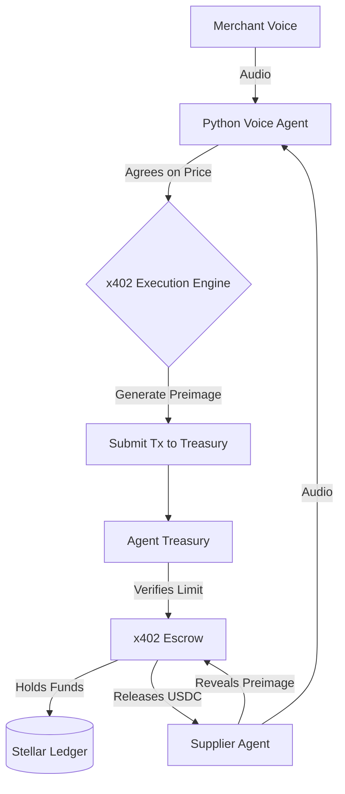

<h1 align="center">VoxTrade Smart Contracts & Agent</h1>

<p align="center">
  The enterprise machine-to-machine commerce orchestrator. A hybrid on-chain and off-chain execution layer built on Stellar and Soroban, enabling autonomous AI Voice Agents to negotiate B2B supply orders and settle payments using the x402 (Metered Payment Protocol) standard.
</p>

<p align="center">
  <a href="https://github.com/voxxtrade/voxtrade-contract/actions/workflows/ci.yml"></a>
  
  
</p>

---

## Core Architecture

This repository adopts a strict separation of concerns, splitting execution across on-chain Soroban contracts and off-chain AI reasoning engines.

1. **Soroban Contracts (Rust)**: Running natively on the Stellar network, these handle the rigid security limits (the 24-hour treasury caps) and the cryptographic escrow locking (HTLCs).
2. **AI Voice Agent (Python)**: Running off-chain, the agent listens to VoIP audio streams, negotiates terms, and acts as the programmatic signer for the smart contracts.

### Hybrid Sequence Flow



### How VoxTrade Works

1. **Merchant Onboarding:** The human merchant uses their Freighter wallet to deploy an `agent_treasury` and authorize the AI's server-side Ed25519 key with a daily limit.
2. **AI Negotiation:** The merchant's Voice Agent calls the supplier's Agent over VoIP. They negotiate bulk pricing in natural language.
3. **Programmatic Settlement:** Once agreed, the merchant's AI signs an `execute_x402_lock` transaction. The treasury verifies the 24-hour limit hasn't been breached and securely locks the USDC in the HTLC `x402_escrow`.
4. **Delivery & Claim:** The supplier AI delivers the goods/API payload and claims the escrow by revealing the SHA256 preimage. If it fails, the funds timeout and refund.

---

## Tech Stack

- **Language**: Rust 2021, Python 3.11+
- **Smart Contracts**: Soroban SDK `20.0.0`
- **Data Ingestion**: Stellar Horizon API & Soroban RPC
- **Testing & Simulation**: Soroban CLI, Make, Pytest

---

## Setup & Quick Start

Check out the commands in the `Makefile` for everyday operations:

```bash
# Clone the repository
git clone https://github.com/voxxtrade/voxtrade-contract.git
cd voxtrade-contract

# Build the Soroban WASM artifacts
make build

# Run Rust contract tests and boundary limits
make test

# Format, lint, and run clippy
make lint

# Run local Soroban node via Docker Compose
make quickstart
```

## Maintainers & Contact

| Maintainer | Contact / Email | Role |
| :--- | :--- | :--- |
| VoxTrade Team | security@voxxtrade.io | Core Protocol Engineering |
| Ogun F. | ogundeleoluwaferanmi35@users.noreply.github.com | Lead Architect |

## Contributors

[](https://github.com/voxxtrade/voxtrade-contract/graphs/contributors)

---

## License

This project is licensed under the Apache 2.0 License - see the [LICENSE](./LICENSE) file for details.

