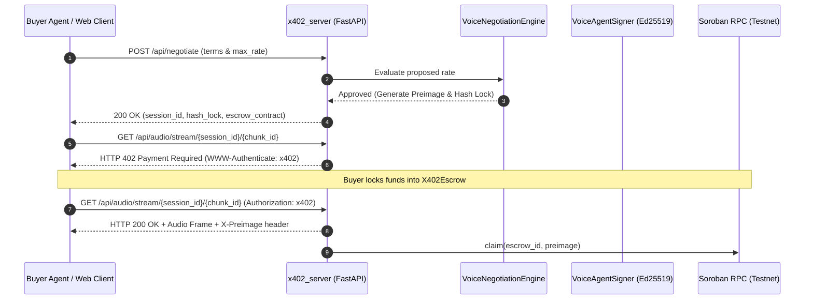

# VoxTrade AI Voice Agent Runtime

> Off-chain autonomous negotiation, cryptographic quote signing, and x402 streaming server for **VoxTrade: Sovereign Voice-to-Voice Commerce on Stellar**.

---

## Overview

The `agent` directory provides the off-chain Python runtime that acts as the automated sales representative, streaming server, and cryptographic transaction constructor for VoxTrade merchants. It interfaces directly with the Soroban smart contracts on the Stellar network:

1. **`negotiation_engine.py`** &mdash; State machine managing real-time voice streaming negotiations, enforcing heuristic price floors and daily spending limits before committing on-chain.
2. **`x402_signer.py`** &mdash; Constructs and cryptographically signs Soroban authorization payloads (`execute_x402_lock`) using an Ed25519 keypair.
3. **`x402_server.py`** &mdash; High-performance FastAPI server implementing the IETF HTTP `402 Payment Required` protocol with SHA-256 preimages and audio chunk streaming.
4. **`test_agent.py`** &mdash; Comprehensive unit test suite covering quote evaluation, state transitions, hashlock verification, and simulated micropayments.

---

## Architecture Flow



---

## Getting Started

### 1. Prerequisites

- Python `3.10` or higher
- `pip` or `uv`

### 2. Installation

Install all required dependencies:

```bash
cd agent
pip install -r requirements.txt
```

### 3. Environment Configuration

Create a `.env` file in the project root or configure your environment:

```env
STELLAR_NETWORK=testnet
SOROBAN_RPC_URL=https://soroban-testnet.stellar.org
AGENT_TREASURY_CONTRACT=CCBZLHEHRUBAHGB72ZZLNHBT4RURGTW2SSSQC4DJDDILVDG4VR55FEJL
X402_ESCROW_CONTRACT=CDJS3VHPBXVSFIPA6FUBVS3YXKUGZ75GQ7TQFVPMHBX3KHMREGGNMLFE
USDC_TOKEN_ID=CDLZFC3SYJYDZT7K67VZ75HPJVIEUVNIXF47ZG2FB2RMQQVU2HHGCYSC
```

### 4. Running the x402 Server

Start the local HTTP 402 payment server:

```bash
uvicorn x402_server:app --host 0.0.0.0 --port 8000 --reload
```

Test the health endpoint:

```bash
curl http://localhost:8000/health
# {"status":"ONLINE","protocol":"x402/v1.0","network":"stellar-testnet"}
```

---

## Running the Test Suite

Run the 11 unit tests covering negotiation states, quota enforcement, and cryptographic signing:

```bash
pytest test_agent.py -v
```

---

## License

Released under the [MIT License](../LICENSE).
