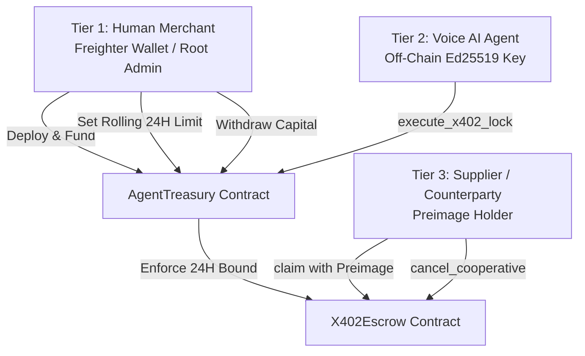

# Smart Account Authorization & Security Model

This document outlines the security architecture and cryptographic authorization model governing **VoxTrade: Sovereign Voice-to-Voice Commerce on Stellar**.

---

## 1. Threat Model & Design Philosophy

Autonomous AI agents transacting over voice channels represent an entirely new paradigm of financial risk:
1. **Unbounded Agent Liability**: An AI assistant cannot be given direct access to an unconstrained private key, credit card, or infinite token approval. Hallucination, adversarial prompt injection, or malicious counterparties could drain user balances.
2. **Execution Asynchrony**: Voice audio streams are volatile and bursty. Transactions occur at sub-second cadence, making manual human confirmation for every micropayment chunk impossible.
3. **Counterparty Non-Delivery**: If an agent pays for digital goods or voice translation upfront without escrow, an adversarial seller can collect payment and terminate the audio stream.

VoxTrade resolves this by implementing a **tripartite tiered authorization model** on Stellar Soroban smart contracts.

---

## 2. Tripartite Authorization Tiers

### Tier 1: Human Merchant (Master Administrator)
- **Credential**: User's non-custodial Stellar wallet (e.g. Freighter, Lobstr).
- **Permissions**:
  - `init`: Deploys and configures the treasury vault.
  - `update_limit`: Adjusts the daily rolling budget in stroops.
  - `update_agent_key`: Rotates the AI agent's operational key without migrating vault balances.
  - `withdraw`: Recalls deposited assets (USDC, XLM) back to the merchant's personal wallet at any time.
- **Enforcement**: Guaranteed on-chain via `admin.require_auth()`.

### Tier 2: Voice AI Agent (Sandboxed Signer)
- **Credential**: Ephemeral or managed Ed25519 keypair held by the off-chain Python/TypeScript agent runtime.
- **Permissions**:
  - `execute_x402_lock`: Routes escrow funding to `X402Escrow`.
- **Sandboxing Guarantees**:
  - The AI **cannot** transfer tokens to arbitrary addresses.
  - The AI **cannot** alter its own spending limit.
  - The AI **cannot** withdraw funds.
  - Cumulative spending is bounded by the rolling 24-hour limit (`current_ledger / 17280`).
- **Enforcement**: Guaranteed on-chain via `agent.require_auth()` and `daily_spend.amount_spent + amount <= config.daily_limit`.

### Tier 3: Service Provider / Counterparty
- **Credential**: Seller's Stellar address and secret preimage ($P$).
- **Permissions**:
  - `claim`: Submits $P$ where $\text{SHA256}(P) = H$.
  - `cancel_cooperative`: Forfeits the escrow early to grant immediate buyer refund.
- **Enforcement**: Cryptographic verification on-chain (`env.crypto().sha256(&preimage) == hash_lock`).

---

## 3. Rolling 24-Hour Epoch Mechanics

Rather than relying on timestamp manipulation, the `AgentTreasury` calculates daily boundaries deterministically using the Stellar ledger sequence:

$$\text{Epoch Day} = \left\lfloor \frac{\text{Ledger Sequence}}{17280} \right\rfloor$$

*(Assuming an average Stellar ledger closure rate of 5 seconds, $17,280 \text{ ledgers} \approx 24 \text{ hours}$.)*

### Invariant Rules:
1. When a transaction is submitted, the contract queries `daily_spend`.
2. If `daily_spend.day != current_day`, the spending accumulator is reset to $0$.
3. If `amount_spent + requested_amount > daily_limit`, the transaction immediately halts with `TreasuryError::LimitExceeded` (Code 5).
4. No off-chain daemon or cron job is needed to reset allowances; the reset is atomic and lazily evaluated on-chain.

---

## 4. Attack Vector Analysis

| Attack Vector | Vector Description | Protocol Mitigation |
|---|---|---|
| **Compromised Agent Key** | An attacker extracts the AI's server-side Ed25519 signing key. | Maximum loss is strictly capped at the 24-hour limit. Attacker cannot withdraw funds to an external wallet; funds can only be sent into `X402Escrow` with valid hash locks. The human merchant can rotate the compromised key instantly via `update_agent_key`. |
| **Prompt Injection / Hallucination** | Malicious audio prompts trick the buyer AI into agreeing to exorbitant pricing ($1,000/sec). | Off-chain heuristic engine rejects quotes $> 0.10 \text{ USDC/chunk}$. On-chain treasury halts execution the instant the daily limit is reached. |
| **Seller Stalling / Non-Delivery** | Seller accepts escrow lock but never streams the audio chunks or discloses the preimage. | All escrows require a `timeout_ledger`. Once the deadline passes, the buyer calls `X402Escrow::refund` to retrieve 100% of the locked assets. |
| **Double Spending / Replay** | Seller attempts to claim the same escrow twice using the revealed preimage. | The `resolved: bool` flag is set to `true` atomically within the first claim. Subsequent claims reject with `EscrowError::AlreadyResolved` (Code 2). |

