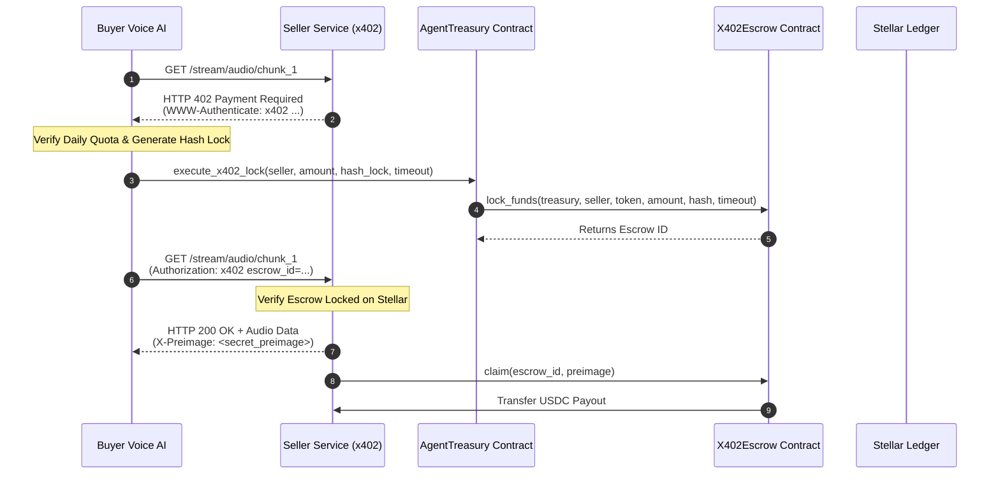

# RFC-0402: Sovereign Voice-to-Voice Commerce Protocol (x402) on Stellar

**Status**: Standard Track  
**Authors**: VoxTrade Core Protocol Team  
**Category**: Standards Track  
**Created**: September 2026  

---

## 1. Abstract

This specification defines the **x402 Sovereign Voice-to-Voice Commerce Protocol**, a decentralized micropayment and streaming exchange framework built for autonomous AI agents on the Stellar network using Soroban smart contracts. It adapts the IETF HTTP `402 Payment Required` status code and Lightning Network Hash Time-Locked Contract (HTLC) paradigms to enable sub-cent, sub-second machine-to-machine settlements without custodial risk or counterparty exposure.

---

## 2. Motivation & Threat Model

In autonomous Voice-to-Voice agent commerce:
1. **Unbounded Agent Risk**: AI agents cannot be entrusted with unconstrained private keys or fiat credit cards. An adversarial prompt or hallucination could drain an entire corporate balance.
2. **Counterparty Execution Risk**: If an agent pays for voice audio chunks, real-time translations, or API calls upfront, malicious service providers may accept payment and fail to deliver the payload.
3. **High Latency & Rail Fees**: Traditional credit card processing fees ($0.30 + 3%) prohibit real-time micro-billing for audio frames (e.g. $0.001 per 2-second Opus packet).

---

## 3. Protocol Architecture

The protocol divides commerce into four distinct phases:



---

## 4. HTTP 402 Challenge & Header Specification

### 4.1 Server Challenge (`HTTP 402 Payment Required`)

When an unauthenticated or unpaid request is received for a monetized resource or audio stream, the server responds with:

```http
HTTP/1.1 402 Payment Required
Content-Type: application/json
WWW-Authenticate: x402 contract_id="CDLZFC3SYJYDZT7K67VZ75HPJVIEUVNIXF47ZG2FB2RMQQVU2HHGCYSC",
                       network="testnet",
                       token="USDC",
                       amount="1000000",
                       hash_lock="3b9a8f712c4d9e018274ac4839201f84b9c1d0ef93847291a0c8b74619372ef4",
                       timeout_ledgers="120",
                       unit="stroops"

{
  "error": "Payment Required",
  "protocol": "x402/v1.0",
  "terms": {
    "price_per_second": 500000,
    "chunk_duration_ms": 2000,
    "total_amount": 1000000,
    "currency": "USDC",
    "hash_lock": "3b9a8f712c4d9e018274ac4839201f84b9c1d0ef93847291a0c8b74619372ef4",
    "escrow_contract": "CDLZFC3SYJYDZT7K67VZ75HPJVIEUVNIXF47ZG2FB2RMQQVU2HHGCYSC",
    "timeout_ledgers": 120
  }
}
```

### 4.2 Client Payment Proof (`Authorization: x402`)

The Buyer Agent verifies that the price matches negotiated terms and does not breach the 24-hour treasury allowance, executes the on-chain lock, and replays the request with payment proof:

```http
GET /stream/audio/chunk_1 HTTP/1.1
Host: api.seller-agent.voxxtrade.io
Authorization: x402 escrow_id="42",
                    tx_hash="f8c37d4e21a998b640e53a2b719460c1d2e3f4a5b6c7d8e9f012345678abcdef",
                    buyer="GBQ3SYJYDZT7K67VZ75HPJVIEUVNIXF47ZG2FB2RMQQVU2HHGCYSC"
```

### 4.3 Payload Delivery & Preimage Disclosure

The Seller verifies the on-chain lock with the specified `hash_lock` and `amount`, then streams the audio payload along with the cryptographic `X-Preimage` header:

```http
HTTP/1.1 200 OK
Content-Type: audio/opus
Content-Length: 16384
X-Preimage: 7f83b1657ff1fc53b92dc18148a1d65dfc2d4b1fa3d677284addd200126d9069
X-Escrow-Id: 42

<binary opus audio frame>
```

---

## 5. Security & Invariants

1. **Deterministic Preimage Hash**: $\text{hash\_lock} = \text{SHA256}(\text{preimage})$.
2. **Strict Timeouts**: If the seller fails to return the preimage or audio chunk within the allotted ledger window, the buyer calls `refund(escrow_id)` and recovers 100% of collateral.
3. **No Front-Running**: Only the party possessing the secret `preimage` can trigger `claim()`. The smart contract transfers funds directly to the immutable `seller` address specified at lock time, making front-running in the transaction mempool impossible.
