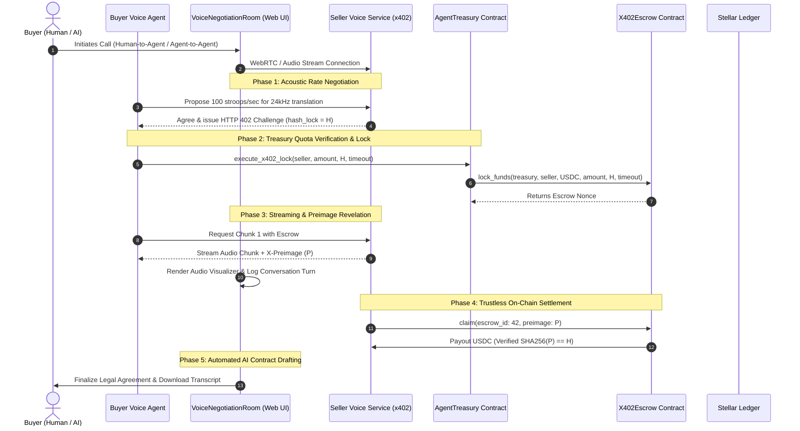

# x402 Sovereign Voice-to-Voice Commerce Protocol Implementation

The **x402 Protocol** translates the IETF HTTP `402 Payment Required` standard and Lightning Network Hash Time-Locked Contract (HTLC) paradigms into high-throughput, sub-cent micropayments on the **Stellar network** using **Soroban smart contracts**.

---

## 1. Acoustic Commerce Architecture

In high-speed voice commerce (e.g. live AI speech translation, automated supplier ordering, customer support booking), payments must keep pace with natural speech cadence (100–300 words per minute).

Traditional payment rails (credit cards, bank transfers) impose $0.30 fixed fees and multi-day settlement times. On Stellar, transactions settle in $\sim 5$ seconds for fractions of a cent (0.00001 XLM gas), enabling:
- Real-time audio packet streaming (e.g. 2-second Opus chunks).
- Direct atomic payment-for-payload exchange.
- Zero counterparty risk without custodial intermediaries.

---

## 2. End-to-End Negotiation & Settlement Lifecycle



---

## 3. Protocol Phases

### Phase 1: Acoustic Handshake & Rate Negotiation
1. The calling agent and receiving service establish an audio communication channel.
2. The user can choose between 3 calling modes in the web app:
   - **Human-to-Agent**: User speaks directly via microphone, AI agent responds.
   - **Agent-to-Agent**: Two AI agents negotiate autonomously based on pre-set parameters.
   - **Human-to-Human**: Two humans negotiate while AI listens and arbitrates contract drafting.
3. The parties negotiate rate terms (e.g. 500,000 stroops per 2-second audio chunk).

### Phase 2: HTTP 402 Challenge & Cryptographic Lock
1. The seller generates a cryptographically random 32-byte secret preimage $P$:
   $$P \leftarrow \text{RandomBytes}(32)$$
   $$H = \text{SHA-256}(P)$$
2. The seller responds with an HTTP 402 challenge:
   ```http
   HTTP/1.1 402 Payment Required
   WWW-Authenticate: x402 contract_id="CDJS3VHPBXVSFIPA6FUBVS3YXKUGZ75GQ7TQFVPMHBX3KHMREGGNMLFE",
                          token="USDC",
                          amount="1000000",
                          hash_lock="3b9a8f712c4d9e018274ac4839201f84b9c1d0ef93847291a0c8b74619372ef4",
                          timeout_ledgers="120"
   ```
3. The buyer agent inspects its daily remaining allowance in `AgentTreasury`.
4. If approved, the buyer executes `execute_x402_lock` on the `AgentTreasury` contract, which routes the lock directly to `X402Escrow`.

### Phase 3: Payload Delivery & Preimage Disclosure
1. The seller verifies on-chain that the escrow is active with the expected `hash_lock` and `amount`.
2. The seller transmits the synthesized audio chunk with the preimage attached:
   ```http
   HTTP/1.1 200 OK
   Content-Type: audio/opus
   X-Preimage: 7f83b1657ff1fc53b92dc18148a1d65dfc2d4b1fa3d677284addd200126d9069
   X-Escrow-Id: 42
   ```

### Phase 4: On-Chain Escrow Settlement
1. The seller submits `X402Escrow::claim(42, preimage)` to the Stellar network.
2. The Soroban VM validates:
   $$\text{SHA-256}(P) \stackrel{?}{=} H$$
3. If valid, the contract releases USDC to the seller.
4. If the seller fails to provide $P$ before the timeout ledger expires, the buyer calls `X402Escrow::refund(42)` to recover 100% of the locked assets.

### Phase 5: Transcript Logging & AI Contract Synthesis
1. During the call, all utterances and negotiation terms are recorded in real-time.
2. The AI generates a structured, verified legal agreement incorporating:
   - Negotiated rate and total stroops settled.
   - On-chain transaction hash and escrow ID references.
   - Parties' Stellar public keys and timestamps.
3. The user can export and download the complete session transcript and contractual terms in JSON or Markdown format.

---

## 4. Multi-Repository Architecture

| Component | Repository | Role |
|---|---|---|
| **Smart Contracts (Rust)** | `voxtrade-contract` | Soroban contracts: `AgentTreasury` (vault) & `X402Escrow` (HTLC). |
| **Agent Runtime (Python)** | `voxtrade-contract` | Off-chain FastAPI streaming server & Ed25519 signer. |
| **TypeScript SDK** | `voxtrade-app` (`packages/sdk`) | Client SDK for Soroban contract interaction and Web Audio synthesis. |
| **Web Console & Voice Lab** | `voxtrade-app` (`apps/web`) | Next.js 14 frontend, 3 call modes, acoustic visualizer, and contract drafting. |


